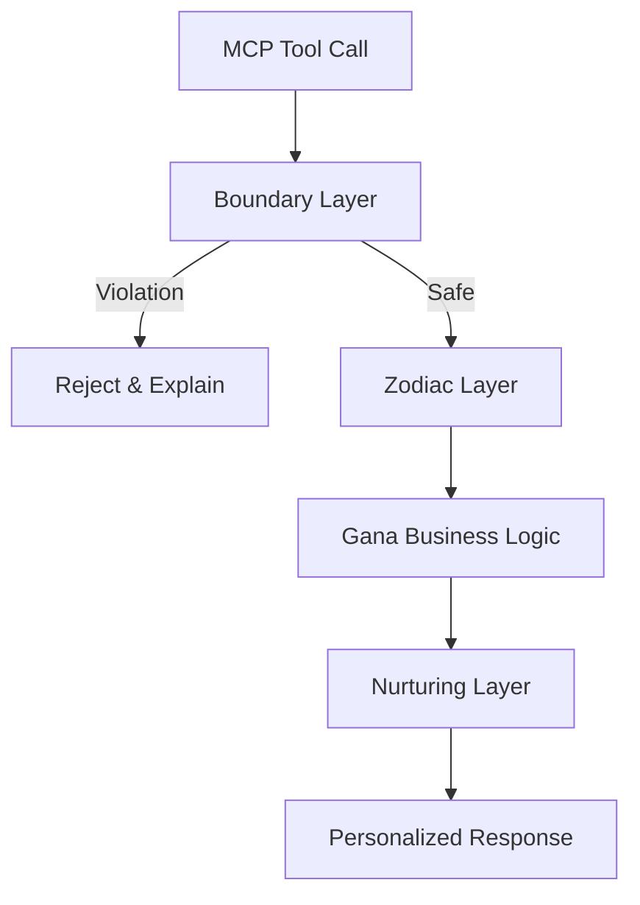

# MCP Integration Plan: The Tri-Engine Wrapper

## Objective
Seamlessly integrate the **Boundary**, **Nurturing**, and **Zodiac** engines into the MCP tool execution flow. This ensures every tool call is safe, personalized, and context-aware without modifying the core logic of 28+ separate tools.

## Architecture: The "Divine Wrapper"

We will implement a Python decorator stack within `whitemagic/mcp_api_bridge.py` that wraps every `gana_*` function.

### Visual Flow


## 1. Boundary Layer (The Wall)
**Engine**: `BoundaryEngine` (Ch. 28)
**Function**: Intercepts the call *before* execution.
- Checks `session_tokens`, `rate_limit`, and `dharma_status`.
- If limit exceeded: Returns standard error JSON immediately.
- If safe: Tracks resource usage (cost) and passes control.

```python
def boundary_guard(cost=1.0):
    def decorator(func):
        def wrapper(*args, **kwargs):
            engine = get_boundary_engine()
            if not engine.check_boundary("api_calls", cost):
                return {"error": "Boundary Violation", "reason": "Rate limit exceeded"}
            # Continue...
            return func(*args, **kwargs)
        return wrapper
    return decorator
```

## 2. Zodiac Layer (The Roof)
**Engine**: `ZodiacEngine` (Ch. 26/12)
**Function**: Injects context *during* execution.
- Adds `current_phase`, `lunar_mansion`, and `recommendation` to the `context` dictionary passed to the function.
- Enables the tool to behave differently based on the "season" (e.g., *Planning* in Spring, *Reviewing* in Winter).

## 3. Nurturing Layer (The Girl)
**Engine**: `NurturingEngine` (Ch. 24)
**Function**: Modifies the output *after* execution.
- Intercepts the return dictionary.
- If `result` contains text, runs it through `personalize_response(user_id, text)`.
- Adds a `warmth` signature or stylistic flair based on user preferences.

## Implementation Strategy

1.  **Create `whitemagic/core/mcp_wrappers.py`**:
    - Implement `TriEngineWrapper` class or composed decorators.
2.  **Apply to `mcp_api_bridge.py`**:
    - Decorate all `gana_*` functions.
    - Example:
      ```python
      @tri_engine_wrapper(mansion="HORN", cost=5.0)
      def gana_horn(...):
          ...
      ```
3.  **Update `task.md`**:
    - Track the refactoring of `mcp_api_bridge.py`.

## Next Steps
- Verify `BoundaryEngine` singleton pattern.
- Verify `NurturingEngine` persistence (where are profiles stored?).
- Begin Phase 10 (Archaeology) with the raw tools, then apply wrappers in parallel.
